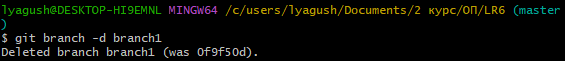

# LR6
Лабораторная работа №6

Скриншоты





Лог команд
```bash
git clone https://github.com/DoubleD-99/LR6.git
git remote add upstream https://github.com/Kurtyanik/LR6.git
git fetch upstream
git checkout -b branch1 upstream/branch1
git checkout master
git checkout branch1
git log --oneline
git checkout master
git log --oneline
git show
git merge branch1
git add mergefile.txt
git commit -m "Разрешён конфликт слияния между master и branch1"
git branch -d branch1
echo "Change 1" >> changes.txt
git add changes.txt
git commit -m "Added first change"
echo "Change 2" >> changes.txt
git add changes.txt
git commit -m "Added second change"
git reset --soft HEAD~1
git checkout -b report
mkdir screenshots
nano README.md
git add .
git commit -m "Added report and screenshots"
git log --pretty=format:"%h %ad %an %s" --date=short
git push origin report
git push origin master
